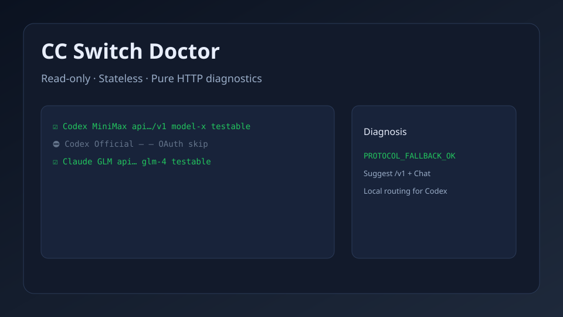

# CC Switch Doctor

**只读 · 无状态 · 纯 HTTP** 的 CC Switch 第三方供应商诊断工具。

> 扫描本地 CC Switch 数据库，勾选配置，通过真实低成本模型请求定位 Key / URL / 协议 / 模型 / 额度问题。  
> **绝不**启动 Codex、Claude、OpenCode、Gemini CLI 或 CC Switch；**绝不**读取官方登录目录；**绝不**写入 CC Switch 数据库。



## 安全保证

| 保证     | 说明                                               |
| -------- | -------------------------------------------------- |
| 纯 HTTP  | 仅 `reqwest` 发请求，CI 禁止 process spawn         |
| 登录隔离 | 不读 `.codex` / `.claude` / OpenCode / `.gemini`   |
| DB 只读  | `mode=ro` + `query_only=ON`，仅 SELECT/PRAGMA      |
| Key 内存 | 完整 Key 不进前端、日志、文件、localStorage        |
| 同源     | 自动变体仅限原 Base URL 同一 Host                  |
| 无状态   | 关闭后无历史、无选择、无结果持久化                 |
| 托管跳过 | OAuth / Copilot / ChatGPT Backend 等硬跳过，无绕过 |

## 支持范围（v0.1.0）

- 平台：Windows 10/11 x64
- 应用：Claude Code、Claude Desktop、Codex、Gemini CLI、OpenCode、OpenClaw、Hermes、Grok Build
- 协议：OpenAI Chat Completions、OpenAI Responses、Anthropic Messages、Gemini Native
- 模式：快速验证 / 智能诊断 / 深度兼容性（含流式与 Tool Calling）

## 安装

### 安装版

下载 Release 中的 `CC-Switch-Doctor-v0.1.0-Windows-x64-setup.exe`，按向导安装（当前用户，无需管理员）。

### 便携版

下载 `CC-Switch-Doctor-v0.1.0-Windows-x64-portable.zip`，解压后运行 `CC-Switch-Doctor.exe`。

### 校验

使用 `SHA256SUMS.txt` 校验下载文件。

### 未签名与 SmartScreen

若 Release 标注 **unsigned**，Windows SmartScreen 可能提示“未知发布者”。这是缺少代码签名证书所致，并非病毒标记。可选择“更多信息 → 仍要运行”，或自行用证书签名后再分发。

## 使用

1. 先安装并至少打开过一次 [CC Switch](https://github.com/farion1231/cc-switch)。
2. 启动 Doctor，确认 DB 已连接、兼容状态为 verified/compatible。
3. 按应用筛选，勾选第三方配置（官方/OAuth 会灰显跳过）。
4. 选择模式（默认智能诊断），查看预估请求数。
5. 开始测试；可随时取消。
6. 根据诊断建议**手动**在 CC Switch 中修改配置。Doctor 不会自动改配置。

## 测试模式

- **快速验证**：只测当前配置，失败不枚举变体。
- **智能诊断（默认）**：失败后尝试 `/v1` 归一、协议/模型候选等，上限 12 次/配置。
- **深度兼容性**：增加流式 SSE、Tool Calling、稳定性复测。

## 常见诊断

| 状态                               | 含义                                           |
| ---------------------------------- | ---------------------------------------------- |
| `CURRENT_CONFIG_OK`                | 当前配置可用                                   |
| `CORRECTED_BASE_PATH_OK`           | 修正 Base/`/v1` 后可用                         |
| `PROTOCOL_FALLBACK_OK`             | 换协议后可用                                   |
| `LOCAL_ROUTING_REQUIRED`           | Chat 可用但 Responses 不可用，Codex 需本地路由 |
| `KEY_INVALID`                      | 401 / Key 无效                                 |
| `QUOTA_EXHAUSTED` / `RATE_LIMITED` | 额度或限流                                     |
| `MANAGED_AUTH_SKIPPED`             | 托管登录已跳过                                 |

## CC Switch 兼容

详见 [`docs/compatibility.md`](docs/compatibility.md) 与 [`compatibility/manifest.json`](compatibility/manifest.json)。

- Baseline：CC Switch **v3.17.0**
- Schema：`user_version = 15`
- 检查日期：2026-07-20

## 构建

前置：Node 20+、Rust stable、Windows MSVC 或 GNU 工具链、WebView2。

```bash
npm ci
npm run security:verify
npm run test
npm run build
cargo test --manifest-path src-tauri/Cargo.toml
npm run tauri build
```

## 发版

推送 tag `v0.1.0` 触发 `.github/workflows/release.yml`，生成 setup / portable / SHA256SUMS 并创建 GitHub Release。

## 已知限制

- 仅 Windows x64 首发
- 无自动修复 / 无 CLI 实测
- 无代码签名时 SmartScreen 可能拦截
- 未知 CC Switch schema 时安全停止，不猜测字段
- 更新检查仅访问 GitHub API，失败不阻塞使用

## 文档

- [架构](docs/architecture.md)
- [安全模型](docs/security-model.md)
- [隐私](PRIVACY.md)
- [安全政策](SECURITY.md)
- [兼容性](docs/compatibility.md)
- [测试策略](docs/testing-strategy.md)
- [发版流程](docs/release-process.md)

## 免责声明

本工具仅供诊断辅助。上游供应商、系统代理、DNS 与杀毒软件可能产生网络日志。使用造成的 API 费用与配置变更责任由用户自行承担。与 CC Switch 官方无隶属关系。

## License

MIT — 见 [LICENSE](LICENSE)
